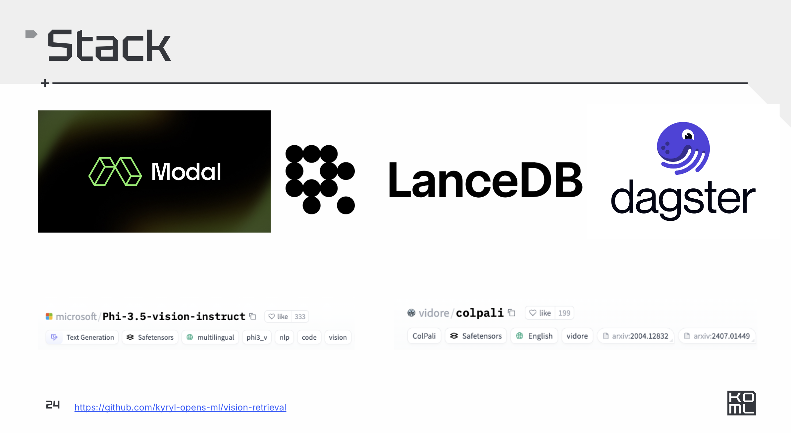

# Vision Retrieval

## Presentation

https://docs.google.com/presentation/d/1LY3KxUjuLAoCvKh9UyXtQupqiSTi_BFNUQ_Cdl6-o_g/edit#slide=id.g2f6ce2a35cc_0_103


## TLDR



## Setup

```
pip install modal
modal setup
```

## Run 

```
modal run vision_retrieval/infra.py
```

## Deploy 


```
modal deploy vision_retrieval/infra.py
```

## Develop

```
modal run vision_retrieval/infra.py
```

## Orchestrate


```
pip install dagster dagster-webserver -U
dagster dev -f vision_retrieval/pipeline.py -p 3000 -h 0.0.0.0
```


## References

- [ColPali](https://arxiv.org/abs/2407.01449)
- [LanceDB](https://lancedb.com/)
- [ModalLab](https://modal.com/)
- [Dagster](https://dagster.io/)
- [Beyond Text: The Rise of Vision-Driven Document Retrieval for RAG](https://blog.vespa.ai/the-rise-of-vision-driven-document-retrieval-for-rag/)
- [PDF Retrieval with Vision Language Models](https://blog.vespa.ai/retrieval-with-vision-language-models-colpali/)